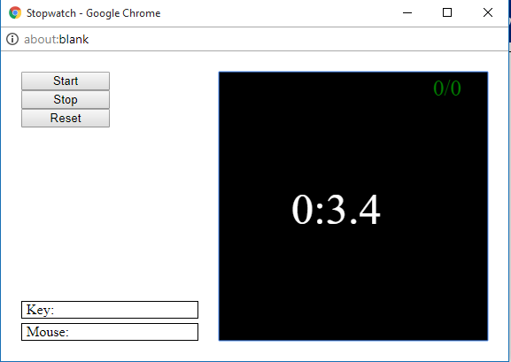

# Stopwatch Game

A simplegui implementation

<i>Check it here</i>: 

<b>Guideline</b>:
There is counter at the top right which counts the number of time you are able to stop the stopwatch at whole number over the
total number of time you stop the stopwatch.

